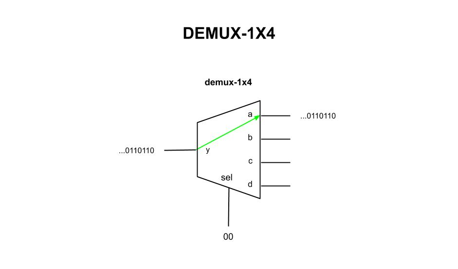

# demux-1x4 example

_Demultiplexer - One input, four outputs (using a case statement)._

[GitHub Webpage](https://jeffdecola.github.io/my-systemverilog-examples/)

## SCHEMATIC

This may help,



## VERILOG CODE

The main part of the code is,

```verilog
    reg  a, b, c, d;

    always @ ( * ) begin
        case(sel)
            2'b00 : begin
                a <= y; b <= 0; c <= 0; d <= 0;
            end
            2'b01 : begin
                a <= 0; b <= y; c <= 0; d <= 0;
            end
            2'b10 : begin
                a <= 0; b <= 0; c <= y; d <= 0;
            end
            2'b11 : begin
                a <= 0; b <= 0; c <= 0; d <= y;
            end
        endcase
    end
```

The entire code is
[demux-1x4.v](demux-1x4.v).

## RUN (SIMULATE)

I used my testbench
[demux-1x4-tb.v](demux-1x4-tb.v) with
[iverilog](https://github.com/JeffDeCola/my-cheat-sheets/tree/master/hardware/tools/simulation/iverilog-cheat-sheet)
to simulate and create a `.vcd` file.

```bash
sh run-test.sh
```

## CHECK WAVEFORM

Check you waveform using your `.vcd` file with a waveform viewer.

I used [GTKWave](https://github.com/JeffDeCola/my-cheat-sheets/tree/master/hardware/tools/simulation/gtkwave-cheat-sheet)
and launch it using
[launch-gtkwave.sh](launch-gtkwave.sh).
