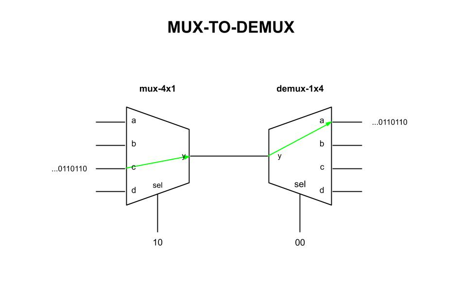

# mux-to-demux example

_Combining the
[mux-4x1](https://github.com/JeffDeCola/my-systemverilog-examples/tree/master/combinational-logic/multiplexers-and-demultiplexers/mux-4x1)
to the
[demux_1x4](https://github.com/JeffDeCola/my-systemverilog-examples/tree/master/combinational-logic/multiplexers-and-demultiplexers/demux-1x4)
to prove the input will equal the output (for the selected output)._

[GitHub Webpage](https://jeffdecola.github.io/my-systemverilog-examples/)

## SCHEMATIC

This may help,



## VERILOG CODE

The main part of the code is,

```verilog
wire  y;

mux_4x1 MUX_4X1 (
    .a(a_in), .b(b_in), .c(c_in), .d(d_in),
    .sel(sel),
    .y(y)
);

demux_1x4 DEMUX_1X4 (
    .y(y),
    .sel(sel),
    .a(a_out), .b(b_out), .c(c_out), .d(d_out)
);
```

The entire code is
[mux-to-demux.v](mux-to-demux.v).

## RUN (SIMULATE)

I used my testbench
[mux-to-demux-tb.v](mux-to-demux-tb.v) with
[iverilog](https://github.com/JeffDeCola/my-cheat-sheets/tree/master/hardware/tools/simulation/iverilog-cheat-sheet)
to simulate and create a `.vcd` file.

```bash
sh run-test.sh
```

## CHECK WAVEFORM

Check you waveform using your `.vcd` file with a waveform viewer.

I used [GTKWave](https://github.com/JeffDeCola/my-cheat-sheets/tree/master/hardware/tools/simulation/gtkwave-cheat-sheet)
and launch it using
[launch-gtkwave.sh](launch-gtkwave.sh).
