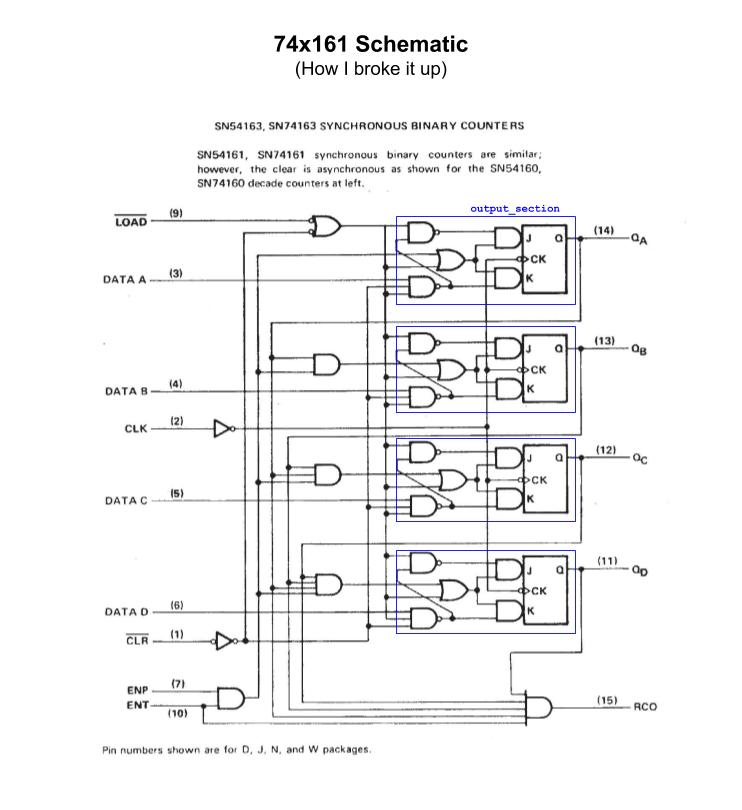

# jeff-74x161 example

_Synchronous presettable 4-bit binary counter, asynchronous clear._

Documentation and reference,

* I'm using my
  [jk-flip-flop](https://github.com/JeffDeCola/my-systemverilog-examples/tree/master/basic-code/sequential-logic/jk-flip-flop)
* This verilog code used in my
  [programable-8-bit-microprocessor](https://github.com/JeffDeCola/my-systemverilog-examples/tree/master/systems/microprocessors/programable-8-bit-microprocessor)

[GitHub Webpage](https://jeffdecola.github.io/my-systemverilog-examples/)

## SCHEMATIC

I designed this processor form the 1976 Texas Instruments spec sheet.



## VERILOG CODE

The main part of the code is,

```verilog
    ?????
```

The entire code is
[jeff-74x161.v](jeff-74x161.v).

## RUN (SIMULATE)

I used my testbench
[jeff-74x161-tb.v](jeff-74x161-tb.v) with
[iverilog](https://github.com/JeffDeCola/my-cheat-sheets/tree/master/hardware/tools/simulation/iverilog-cheat-sheet)
to simulate and create a `.vcd` file.

```bash
sh run-test.sh
```

## CHECK WAVEFORM

Check you waveform using your `.vcd` file with a waveform viewer.

I used [GTKWave](https://github.com/JeffDeCola/my-cheat-sheets/tree/master/hardware/tools/simulation/gtkwave-cheat-sheet)
and launch it using
[launch-gtkwave.sh](launch-gtkwave.sh).
