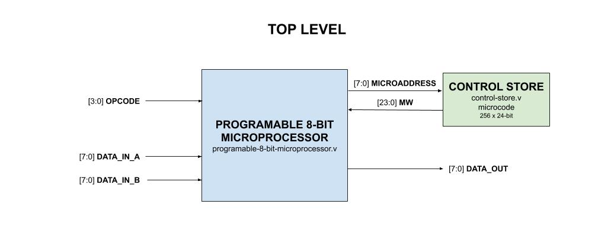
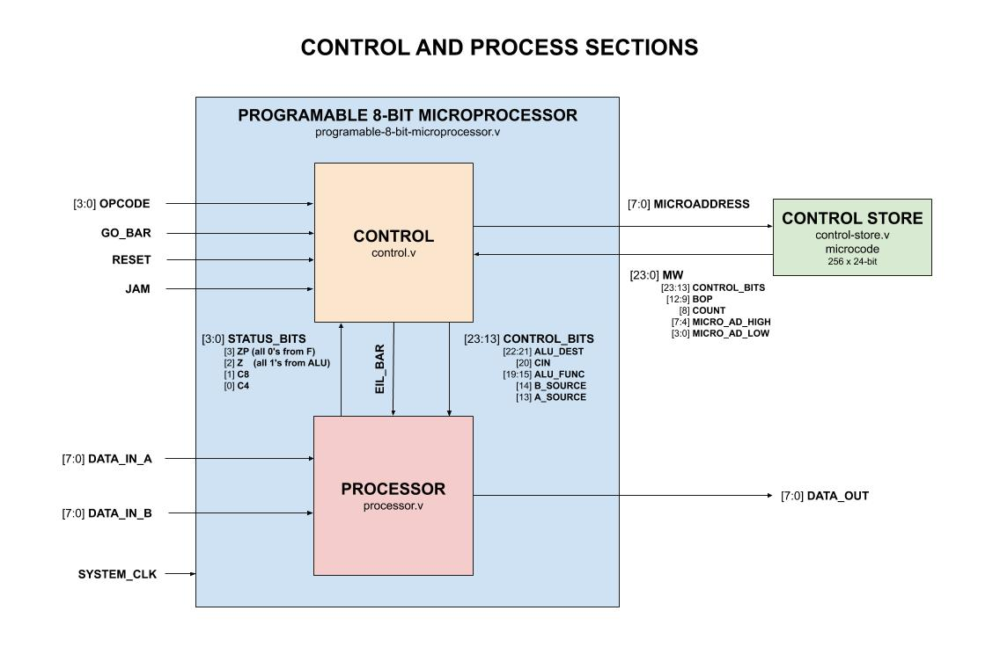
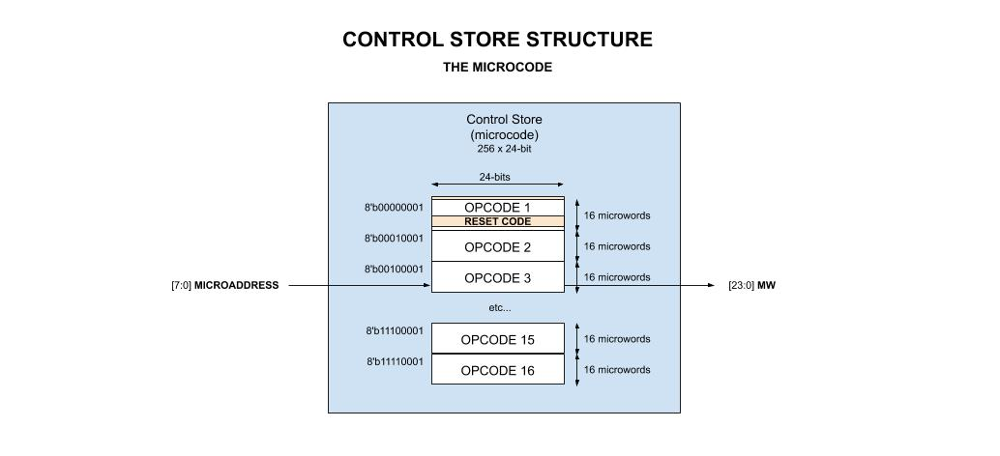
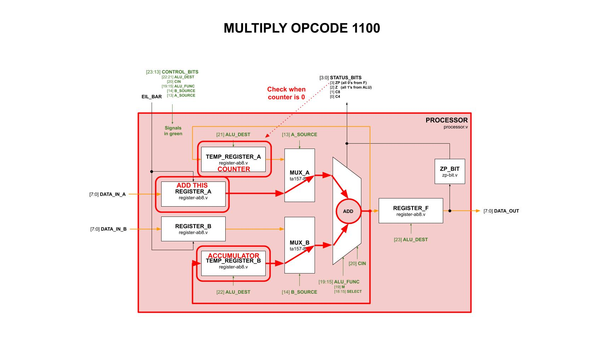
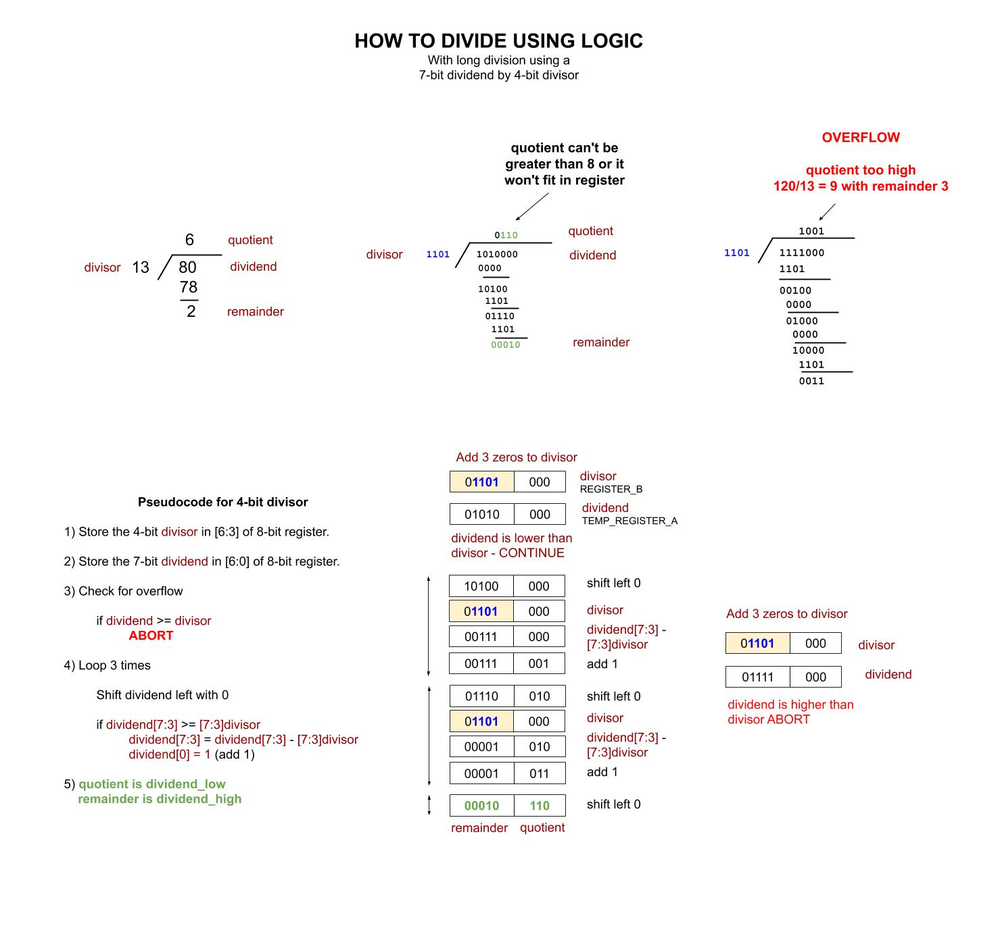
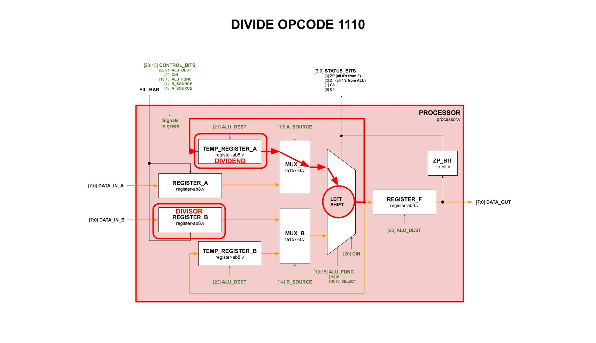
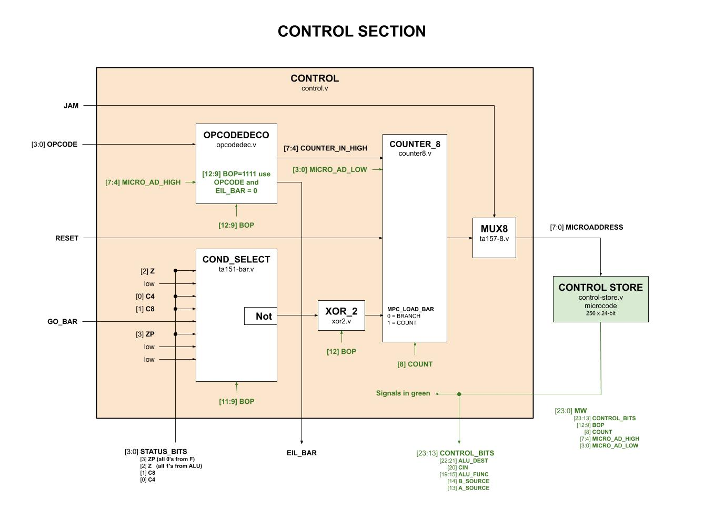
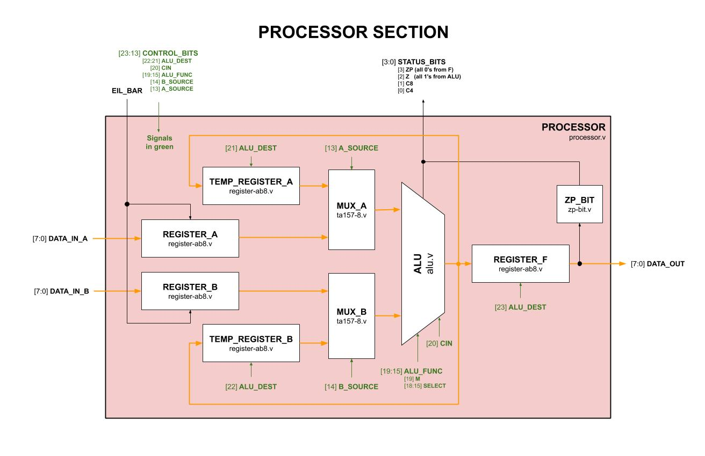
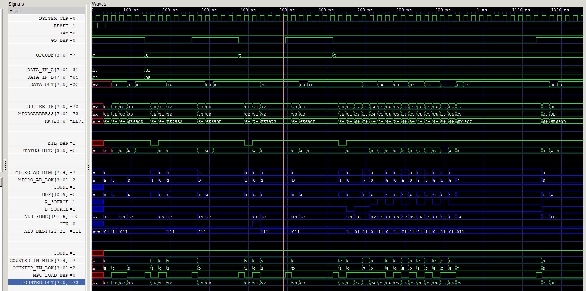
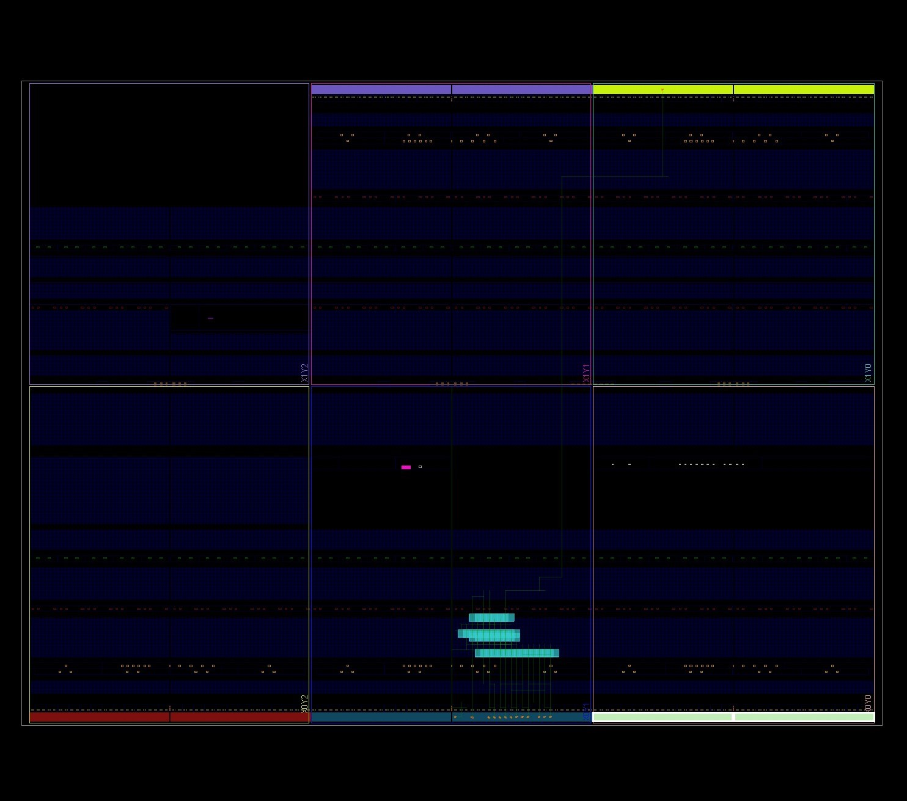

# programable-8-bit-microprocessor example

_I designed this processor in VHDL for my part of my
[Master's Thesis](https://github.com/JeffDeCola/my-masters-thesis).
I translated it into verilog here. As of today I have programmed this
microprocessor to add, subtract, multiply and divide. I also used
[Xilinx Vivado](https://github.com/JeffDeCola/my-cheat-sheets/tree/master/hardware/tools/synthesis/xilinx-vivado-cheat-sheet)
to synthesize and program these verilog examples on a
[Digilent ARTY-S7](https://github.com/JeffDeCola/my-cheat-sheets/tree/master/hardware/development/fpga-development-boards/digilent-arty-s7-cheat-sheet)
FPGA development board._

Table of Contents,

* [STATS](https://github.com/JeffDeCola/my-systemverilog-examples/tree/master/systems/microprocessors/programable-8-bit-microprocessor#stats)
* [TOP LEVEL (HOW IT WORKS)](https://github.com/JeffDeCola/my-systemverilog-examples/tree/master/systems/microprocessors/programable-8-bit-microprocessor#top-level-how-it-works)
  * [THE CONTROL AND PROCESSOR SECTION](https://github.com/JeffDeCola/my-systemverilog-examples/tree/master/systems/microprocessors/programable-8-bit-microprocessor#the-control-and-processor-section)
* [OPCODE (THE USER INSTRUCTION SET)](https://github.com/JeffDeCola/my-systemverilog-examples/tree/master/systems/microprocessors/programable-8-bit-microprocessor#opcode-the-user-instruction-set)
* [MICROCODE (THE INTERNAL INSTRUCTIONS)](https://github.com/JeffDeCola/my-systemverilog-examples/tree/master/systems/microprocessors/programable-8-bit-microprocessor#microcode-the-internal-instructions)
  * [RESET (opcode 0000)](https://github.com/JeffDeCola/my-systemverilog-examples/tree/master/systems/microprocessors/programable-8-bit-microprocessor#reset-opcode-0000)
  * [ADD (opcode 0011)](https://github.com/JeffDeCola/my-systemverilog-examples/tree/master/systems/microprocessors/programable-8-bit-microprocessor#add-opcode-0011)
  * [SUBTRACT (opcode 0111)](https://github.com/JeffDeCola/my-systemverilog-examples/tree/master/systems/microprocessors/programable-8-bit-microprocessor#subtract-opcode-0111)
  * [MULTIPLY (opcode 1100)](https://github.com/JeffDeCola/my-systemverilog-examples/tree/master/systems/microprocessors/programable-8-bit-microprocessor#multiply-opcode-1100)
  * [DIVIDE (opcode 1110)](https://github.com/JeffDeCola/my-systemverilog-examples/tree/master/systems/microprocessors/programable-8-bit-microprocessor#divide-opcode-1110)
  * [DEFAULT](https://github.com/JeffDeCola/my-systemverilog-examples/tree/master/systems/microprocessors/programable-8-bit-microprocessor#default)
* [MORE DETAIL (UNDER THE HOOD)](https://github.com/JeffDeCola/my-systemverilog-examples/tree/master/systems/microprocessors/programable-8-bit-microprocessor#more-detail-under-the-hood)
  * [CONTROL SECTION](https://github.com/JeffDeCola/my-systemverilog-examples/tree/master/systems/microprocessors/programable-8-bit-microprocessor#control-section)
  * [PROCESSOR SECTION](https://github.com/JeffDeCola/my-systemverilog-examples/tree/master/systems/microprocessors/programable-8-bit-microprocessor#processor-section)
* [RUN (SIMULATE)](https://github.com/JeffDeCola/my-systemverilog-examples/tree/master/systems/microprocessors/programable-8-bit-microprocessor#run-simulate)
* [CHECK WAVEFORM](https://github.com/JeffDeCola/my-systemverilog-examples/tree/master/systems/microprocessors/programable-8-bit-microprocessor#check-waveform)
* [TESTED IN HARDWARE - BURNED TO A FPGA](https://github.com/JeffDeCola/my-systemverilog-examples/tree/master/systems/microprocessors/programable-8-bit-microprocessor#tested-in-hardware---burned-to-a-fpga)

Logic parts used. All can be synthesized,

* [and2](https://github.com/JeffDeCola/my-systemverilog-examples/tree/master/basic-code/combinational-logic/and2)
  2-input AND gate
* [nand4](https://github.com/JeffDeCola/my-systemverilog-examples/tree/master/basic-code/combinational-logic/nand4)
  4-input NAND gate
* [nor2](https://github.com/JeffDeCola/my-systemverilog-examples/tree/master/basic-code/combinational-logic/nor2)
  2-input OR gate
* [not1](https://github.com/JeffDeCola/my-systemverilog-examples/tree/master/basic-code/combinational-logic/not1)
  NOT gate
* [or2](https://github.com/JeffDeCola/my-systemverilog-examples/tree/master/basic-code/combinational-logic/or2)
  2-input OR gate
* [xor2](https://github.com/JeffDeCola/my-systemverilog-examples/tree/master/basic-code/combinational-logic/xor2)
  2-input XOR gate
* [d-flip-flop](https://github.com/JeffDeCola/my-systemverilog-examples/tree/master/basic-code/sequential-logic/d-flip-flop)
  A positive edge d flip-flop with synchronous enable (Used in jeff-74x377)
* [jk-flip-flop](https://github.com/JeffDeCola/my-systemverilog-examples/tree/master/basic-code/sequential-logic/jk-flip-flop)
  A positive edge jk flip-flop with synchronous clear (Used in jeff-74x161)
* [jeff-74x181](https://github.com/JeffDeCola/my-systemverilog-examples/tree/master/combinational-logic/alus/jeff-74x181)
  4-bit alu (arithmetic logic unit) and function generator
* [jeff-74x151](https://github.com/JeffDeCola/my-systemverilog-examples/tree/master/combinational-logic/multiplexers-and-demultiplexers/jeff-74x151)
  8-line to 1-line data selector/multiplexer
* [jeff-74x157](https://github.com/JeffDeCola/my-systemverilog-examples/tree/master/combinational-logic/multiplexers-and-demultiplexers/jeff-74x157)
  Quad 2-line to 1-line data selector/multiplexer, non-inverting outputs
* [jeff-74x161](https://github.com/JeffDeCola/my-systemverilog-examples/tree/master/sequential-logic/counters/jeff-74x161)
  Synchronous presettable 4-bit binary counter, asynchronous clear
* [jeff-74x377](https://github.com/JeffDeCola/my-systemverilog-examples/tree/master/sequential-logic/registers/jeff-74x377)
  8-bit register, clock enable

[GitHub Webpage](https://jeffdecola.github.io/my-systemverilog-examples/)

## STATS

* Build around the
  [74x161](https://github.com/JeffDeCola/my-systemverilog-examples/tree/master/combinational-logic/alus/jeff-74x181)
  ALU
  * 16 binary arithmetic operations
  * 16 logic operations
  * 4-bit words
* 8-bit data processing
* Up to 16 Opcodes
  * Programable via microcode
  * [RESET](https://github.com/JeffDeCola/my-systemverilog-examples/tree/master/systems/microprocessors/programable-8-bit-microprocessor#reset-opcode-0000),
    [ADD](https://github.com/JeffDeCola/my-systemverilog-examples/tree/master/systems/microprocessors/programable-8-bit-microprocessor#add-opcode-0011),
    [SUBTRACT](https://github.com/JeffDeCola/my-systemverilog-examples/tree/master/systems/microprocessors/programable-8-bit-microprocessor#subtract-opcode-0111),
    [MULTIPLY](https://github.com/JeffDeCola/my-systemverilog-examples/tree/master/systems/microprocessors/programable-8-bit-microprocessor#multiply-opcode-1100)
    &
    [DIVIDE](https://github.com/JeffDeCola/my-systemverilog-examples/tree/master/systems/microprocessors/programable-8-bit-microprocessor#divide-opcode-1110)
* Microcode
  * 256 x 24-bit microcode storage
  * 24-bit microword
* Pin count
  * 32 pins if using hardcoded internal microcode
    * 24 Input pins
    * 8 Output pins
  * 64 if using external microcode
    * 48 Input pins
    * 16 Output pins
* Synthesizable verilog code

## TOP LEVEL (HOW IT WORKS)

**Based on an instruction (opcode) this processor takes in data,
processes that data (via the alu and microcode instructions)
and spits out the result. That's about it.**

This may help,



MAIN INPUTS,

* [3:0] **OPCODE** _The instruction like ADD and SUBTRACT_
* [7:0] **DATA_IN_A**
* [7:0] **DATA_IN_B**

OUTPUT,

* [7:0] **DATA_OUT**

OTHER INPUTS,

* **SYSTEM_CLK**  _Clock_
* **GO_BAR** _Active low kicks it off opcode_
* **JAM** _Active high will cause Microaddress to be 8'hff_
* **RESET** _Reset (active low) the counter (opcode 0000)_

### THE CONTROL AND PROCESSOR SECTION

This design is broken into two main sections,

* **TOP**
  ([programable-8-bit-microprocessor.v](https://github.com/JeffDeCola/my-systemverilog-examples/blob/master/systems/microprocessors/programable-8-bit-microprocessor/programable-8-bit-microprocessor.v))
  * **CONTROL_SECTION**
    ([control.v](https://github.com/JeffDeCola/my-systemverilog-examples/blob/master/systems/microprocessors/programable-8-bit-microprocessor/control/control.v))
    * The brains. Handles the opcode, microcode and control the process section
  * **PROCESSOR_SECTION**
    ([processor.v](https://github.com/JeffDeCola/my-systemverilog-examples/blob/master/systems/microprocessors/programable-8-bit-microprocessor/processor/processor.v))
    * Crunches the data controlled by the control section

A little more top level detail from my
[Master's Thesis](https://github.com/JeffDeCola/my-masters-thesis),



## OPCODE (THE USER INSTRUCTION SET)

The `opcode` (Operation Code) is the instruction set telling the processor
it what to do. Instructions are implemented in microroutines (i.e. microcode).
In this design there can be up to 16 opcodes.

This is what I have coded so far,

* [3:0] **OPCODE**
  * 0000:
    [RESET](https://github.com/JeffDeCola/my-systemverilog-examples/tree/master/systems/microprocessors/programable-8-bit-microprocessor#reset-opcode-0000)
  * 0011:
    [ADD](https://github.com/JeffDeCola/my-systemverilog-examples/tree/master/systems/microprocessors/programable-8-bit-microprocessor#add-opcode-0011)
  * 0111:
    [SUBTRACT](https://github.com/JeffDeCola/my-systemverilog-examples/tree/master/systems/microprocessors/programable-8-bit-microprocessor#subtract-opcode-0111)
  * 1100:
    [MULTIPLY](https://github.com/JeffDeCola/my-systemverilog-examples/tree/master/systems/microprocessors/programable-8-bit-microprocessor#multiply-opcode-1100)
  * 1110:
    [DIVIDE](https://github.com/JeffDeCola/my-systemverilog-examples/tree/master/systems/microprocessors/programable-8-bit-microprocessor#divide-opcode-1110)

## MICROCODE (THE INTERNAL INSTRUCTIONS)

The `microcode`are the internal instructions the processor uses
to accomplish the users opcode instruction.

The control section gets the microword **[23:0] MW** using the
**[7:0] MICROADDRESS**. Hence there can be up to 256 x 24-bit microwords.

Each opcode accesses a section of this memory.  Hence, there are 16
sections equally divided.

This may help,



The 24-bit microword (MW) fields are as follows,

* [23:0] **MW**
  * [3:0] **MICRO_AD_LOW** _Input address into counter_
  * [7:4] **MICRO_AD_HIGH**
  * [8] **COUNT** _Enable Counter to count_
  * [12:9] **BOP** _Branch OPeration for counter that controls counter load_
  * [23:13] CONTROL_BITS
    * [13] **A_SOURCE** _Input to alu (Input reg or Temp reg)_
    * [14] **B_SOURCE**
    * [19:15] **ALU_FUNC** _The alu functions (refer to
      [jeff-74x181](https://github.com/JeffDeCola/my-systemverilog-examples/tree/master/combinational-logic/alus/jeff-74x181))_
    * [20] **CIN** _Carry input for alu_
    * [23:21] **ALU_DEST** *Output from alu (TEMP_A TEMP_B or F registers)*

The first 13 bits are used in the control sections and the top 13 bits
are used in the process section.

The bits do the following actions,

| FIELD         | BITS     |  MEANING                                        | PNEUMONIC           |
|--------------:|---------:|:------------------------------------------------|---------------------|
| **ALU_DEST**  | 000      | F, TempB, TempA                                 | F_TB_TA             |
|               | 001      | F, TempB                                        | F_TB                |
|               | 010      | F, TempA                                        | F_TA                |
|               | 011      | F                                               | F                   |
|               | 100      | TempB, TempA                                    | TB_TA               |
|               | 101      | TempB                                           | TB                  |
|               | 110      | TempA                                           | TA                  |
|               | **111**  | **Result Not Stored (Default)**                 | NONE (DEFAULT)      |
|               |          |                                                 |                     |
| **CIN**       | 1        | Carry input                                     | CARRY               |
|               | 0        | **No Carry (DEFAULT)**                          | NO_CARRY (DEFAULT)  |
|               |          |                                                 |                     |
| **ALU_FUNC**  | 0 0000   | M=0 ARITH -  A                                  | A                   | 
|               | 0 0001   | M=0 ARITH - A+B                                 | A+B                 |
|               | 0 0010   | M=0 ARITH - A+!B                                | A+!B                |
|               | 0 0011   | M=0 ARITH - MINUS 1 (2's compliment)            | MINUS 1             |
|               | 0 0100   | M=0 ARITH - A PLUS A(!B)                        | A PLUS A(!B)        |
|               | 0 0101   | M=0 ARITH - (A+B) PLUS A(!B)                    | (A+B) PLUS A(!B)    |
|               | 0 0110   | M=0 ARITH - A MINUS B MINUS 1                   | A MINUS B MINUS 1   |
|               | 0 0111   | M=0 ARITH - A(!B) MINUS 1                       | A(!B) MINUS 1       |
|               | 0 1000   | M=0 ARITH - A PLUS AB                           | A PLUS AB           |
|               | 0 1001   | M=0 ARITH - A PLUS B                            | A_PLUS_B            |
|               | 0 1010   | M=0 ARITH - (A+!B) PLUS AB                      | (A+!B) PLUS AB      |
|               | 0 1011   | M=0 ARITH - AB MINUS 1                          | AB MINUS 1          |
|               | 0 1100   | M=0 ARITH - A PLUS A (bit shifted)              | A PLUS A (bit shift)|
|               | 0 1101   | M=0 ARITH - (A+B) PLUS A                        | (A+B) PLUS A        |
|               | 0 1110   | M=0 ARITH - (A+!B) PLUS A                       | (A+!B) PLUS A       |
|               | 0 1111   | M=1 ARITH - A MINUS 1                           | A_MINUS_1           |
|               | 1 0000   | M=1 LOGIC - !A                                  | !A                  |
|               | 1 0001   | M=1 LOGIC - !(A+B)                              | !(A+B)              |
|               | 1 0010   | M=1 LOGIC - (!A)B                               | (!A)B               |
|               | 1 0011   | M=1 LOGIC - O                                   | 0                   |
|               | 1 0100   | M=1 LOGIC - !(AB)                               | !(AB)               |
|               | 1 0101   | M=1 LOGIC - !B                                  | !B                  |
|               | 1 0110   | M=1 LOGIC - A^B                                 | A^B                 |
|               | 1 0111   | M=1 LOGIC - A(!B)                               | A(!B)               |
|               | 1 1000   | M=1 LOGIC - !A+B                                | !A+B                |
|               | 1 1001   | M=1 LOGIC - !(A^B)                              | !(A^B)              |
|               | 1 1010   | M=1 LOGIC - B                                   | B                   |
|               | 1 1011   | M=1 LOGIC - AB                                  | AB                  |
|               | 1 1100   | M=1 LOGIC - **1 (DEFAULT)**                     | 1 (DEFAULT)         |
|               | 1 1101   | M=1 LOGIC - A+!B                                | A+!B                |
|               | 1 1110   | M=1 LOGIC - A+B                                 | A+B                 |
|               | 1 1111   | M=1 LOGIC - A                                   | A                   |
|               |          |                                                 |                     |
| **B_SOURCE**  | **0**    | **Temp reg drives ALU (DEFAULT)**               | TEMP_B (DEFAULT)    |
|               | 1        | Input reg drives ALU                            | INPUT_B             |
|               |          |                                                 |                     |
| **A_SOURCE**  | **0**    | **Temp reg drives ALU (DEFAULT)**               | TEMP_A (DEFAULT)    |
|               | 1        | Input reg drives ALU                            | INPUT_A             |
|               |          |                                                 |                     |
| **BOP**       | 0 000    | Branch on Z (all 1's from ALU)                  | Z (all 1's from alu)|
|               | 0 001    | COUNT - low                                     | COUNT               |
|               | 0 010    | Branch if C4                                    | C4                  |
|               | 0 011    | Branch if C8                                    | C8                  |
|               | 0 100    | Branch if G0_BAR                                | GO_BAR              |
|               | 0 101    | Branch if ZP | ZP (all 0's from F)              | ZP (all O's from F) |
|               | 0 110    | COUNT - low - **(DEFAULT)**                     | COUNT (DEFAULT)     |
|               | 0 111    | COUNT - low                                     | COUNT               |
|               | 1 000    | Branch if !Z (all 1's from ALU)                 | !Z (all 1s from alu)|
|               | 1 001    | Branch Always - low                             | BRANCH              |
|               | 1 010    | Branch if !C4                                   | !C4                 |
|               | 1 011    | Branch if !C8                                   | !C8                 |
|               | 1 100    | Branch if !G0_BAR                               | !GO_BAR             |
|               | 1 101    | Branch if !ZP | !ZP (all 0's from F)            | !ZP (all O's from F)|
|               | 1 110    | Branch Always - low                             | BRANCH              |
|               | 1 111    | Branch on OPCODE (This also loads input Reg)    | OPCODE (LOADS A,B)  |
|               |          |                                                 |                     |
| **COUNT**     | **1**    | **Counter will count if not loaded (DEFAULT)**  | COUNT_IF_NO_LD (D)  |
|               | 0        | Counter will not count                          | NO_COUNT            |

The microcode is located in
[control-store.v](https://github.com/JeffDeCola/my-systemverilog-examples/blob/master/systems/microprocessors/programable-8-bit-microprocessor/control-store/control-store.v).

### RESET (opcode 0000)

This will put the processor into a known state and wait for go.
We use opcode 0000 since the counter is reset to 0000.
For some indication it's working correctly it also outputs 8'h11 to DATA_OUT
(i.e. the F register) to show it's in a wait state.

| ADDR | ALU_DEST | CIN | ALU_FUNC    | B_SOURCE | A_SOURCE |  BOP    | COUNT | ADDR |
|-----:|:--------:|:---:|:-----------:|:--------:|:--------:|:-------:|:-----:|:----:|
| 00   | F        |  0  | 1           |  X        | X       | BRANCH  |   1   | OB   |
| 0B   | TB_TA    |  0  | 1           |  X        | X       | COUNT   |   1   | XX   |
| 0C   | F        |  0  | 0           |  X        | X       | COUNT   |   1   | XX   |
| OD   | F        |  0  | 1           |  X        | X       | G0_BAR  |   1   | OD   |
| OE   | F        |  0  | 1           |  X        | X       | OPCODE  |   1   | X1   |

### ADD (opcode 0011)

This will add A PLUS B. T The microcode is,

| ADDR | ALU_DEST | CIN | ALU_FUNC    | B_SOURCE | A_SOURCE |  BOP    | COUNT | ADDR |
|-----:|:--------:|:---:|:-----------:|:--------:|:--------:|:-------:|:-----:|:----:|
| 31   | F        |  0  | A_PLUS_B    | INPUT_B  | INPUT_A  | COUNT   |   1   | XX   |
| 32   | NONE     |  0  | 1           | X        | X        | !GO_BAR |   1   | 32   |
| 33   | F        |  0  | 0           | X        | X        | BRANCH  |   1   | 0D   |

### SUBTRACT (opcode 0111)

This will subtract A MINUS B. The microcode is,

| ADDR | ALU_DEST | CIN | ALU_FUNC    | B_SOURCE | A_SOURCE |  BOP    | COUNT | ADDR |
|-----:|:--------:|:---:|:-----------:|:--------:|:--------:|:-------:|:-----:|:----:|
| 71   | F        |  1  | A_MINUS_B   | INPUT_B  | INPUT_A  | COUNT   |   1   | XX   |
| 72   | NONE     |  0  | 1           | X        | X        | !GO_BAR |   1   | 72   |
| 73   | F        |  0  | 0           | X        | X        | BRANCH  |   1   | 0D   |

### MULTIPLY (opcode 1100)

This will multiply A TIMES B. Keep the numbers small to fit into 8-bits.

The microcode is,

| ADDR | ALU_DEST | CIN | ALU_FUNC    | B_SOURCE | A_SOURCE |  BOP    | COUNT | ADDR |
|-----:|:--------:|:---:|:-----------:|:--------:|:--------:|:-------:|:-----:|:----:|
| C1   | TB       |  0  | 0           | X        | X        | COUNT   |   1   | XX   |
| C2   | F        |  0  | B           | INPUT_B  | X        | COUNT   |   1   | XX   |
| C3   | TA       |  0  | B           | INPUT_B  | X        | !ZP     |   1   | C7   |
| C4   | F_TA     |  0  | A_MINUS_1   | X        | TEMP_A   | COUNT   |   1   | XX   |
| C5   | TB       |  0  | A_PLUS_B    | TEMP_B   | INPUT_A  | COUNT   |   1   | XX   |
| C6   | F_TA     |  0  | A_MINUS_1   | X        | TEMP_A   | ZP      |   1   | C5   |
| C7   | F        |  0  | B           | TEMP_B   | X        | !GO_BAR |   1   | C7   |
| C8   | F        |  0  | 0           | X        | X        | BRANCH  |   1   | 0D   |

This may help,



### DIVIDE (opcode 1110)

This will divide a 7-bit **dividend** A from a 4-bit **divisor** B.
The **quotient** will be the lower 3 bits and the **remainder**
will be the upper 5 bits of the output.

Some limits & rules:

* DIVIDEND
  * 7-bits
  * Use DATA_IN_A[6:0]
  * Can be between decimal 1-127 (8'b0000000-8'b01111111)
* DIVISOR
  * 4-bits
  * Use DATA_IN_B[6:3] (Add 3 zeros to bottom bits)
  * Can be between decimal 1-15 (8'b0001-8'b1111)
* QUOTIENT
  * DATA_OUT[2:0]
* REMAINDER
  * DATA_OUT[7:3]
* OVERFLOW
  * Occurs when quotient is greater than 16
  * DATA_OUT will be 8'hFF.

As an example, if you want to divide 80 (7'b1010000) by 13 (4'b1101).
The answer is quotient 6 with a remainder of 2,

* DATA_IN_A = 8'b01010000 (DIVIDEND)
* DATA_IN_B = 8'b01101000 (DIVISOR)
* DATA_OUT
  * DATA_OUT[7:3] = 00010 (REMAINDER) 2
  * DATA_OUT[2:0] = 110 (QUOTIENT) 6

The microcode is,

| ADDR | ALU_DEST | CIN | ALU_FUNC    | B_SOURCE | A_SOURCE |  BOP    | COUNT | ADDR |
|-----:|:--------:|:---:|:-----------:|:--------:|:--------:|:-------:|:-----:|:----:|
| E1   | TA       | 0   | A           | X        | INPUT_A  | COUNT   | 1     | XX   |
| E2   | NONE     | 1   | A_MINUS_B_1 | INPUT_B  | TEMP_A   | C8      | 1     | F0   |
|      |          |     |             |          |          |         |       |      |
| E3   | TA       | 0   | A PLUS A sh | X        | TEMP_A   | COUNT   | 1     | XX   |
| E4   | NONE     | 1   | A_MINUS_B_1 | INPUT_B  | TEMP_A   | !C8     | 1     | E7   |
| E5   | TA       | 1   | A_MINUS_B_1 | INPUT_B  | TEMP_A   | COUNT   | 1     | XX   |
| E6   | TA       | 1   | A           | X        | TEMP_A   | COUNT   | 1     | XX   |
|      |          |     |             |          |          |         |       |      |
| E7   | TA       | 0   | A PLUS A sh | X        | TEMP_A   | COUNT   | 1     | XX   |
| E8   | NONE     | 1   | A_MINUS_B_1 | INPUT_B  | TEMP_A   | !C8     | 1     | EB   |
| E9   | TA       | 1   | A_MINUS_B_1 | INPUT_B  | TEMP_A   | COUNT   | 1     | XX   |
| EA   | TA       | 1   | A           | X        | TEMP_A   | COUNT   | 1     | XX   |
|      |          |     |             |          |          |         |       |      |
| EB   | TA       | 0   | A PLUS A sh | X        | TEMP_A   | COUNT   | 1     | XX   |
| EC   | NONE     | 1   | A_MINUS_B_1 | INPUT_B  | TEMP_A   | !C8     | 1     | EF   |
| ED   | TA       | 1   | A_MINUS_B_1 | INPUT_B  | TEMP_A   | COUNT   | 1     | XX   |
| EE   | TA       | 1   | A           | X        | TEMP_A   | COUNT   | 1     | XX   |
|      |          |     |             |          |          |         |       |      |
| EF   | F        | 0   | A           | X        | TEMP_A   | BRANCH  | 1     | F1   |
|      |          |     |             |          |          |         |       |      |
| F0   | F        | 0   | 1           | X        | X        | COUNT   | 1     | XX   |
| F1   | NONE     | 0   | A           | X        | X        | !GO_BAR | 1     | F1   |
| F2   | F        | 0   | 0           | X        | X        | BRANCH  | 1     | 0D   |

These diagrams may help,





### DEFAULT

If system runs into trouble, it will default to this and send back to RESET.

| ADDR | ALU_DEST | CIN | ALU_FUNC    | B_SOURCE | A_SOURCE |  BOP    | COUNT | ADDR |
|-----:|:--------:|:---:|:-----------:|:--------:|:--------:|:-------:|:-----:|:----:|
| deflt| F        |  0  | 1           | X        | X        | BRANCH  |   1   | 00   |

## MORE DETAIL (UNDER THE HOOD)

Here is a little more detail of the control and processor sections.

### CONTROL SECTION

The control section has five main parts,

* **CONTROL_SECTION**
  ([control.v](https://github.com/JeffDeCola/my-systemverilog-examples/blob/master/systems/microprocessors/programable-8-bit-microprocessor/control/control.v))
  * **COUNTER_8**
    ([counter8.v](https://github.com/JeffDeCola/my-systemverilog-examples/blob/master/systems/microprocessors/programable-8-bit-microprocessor/core-parts/counter8.v))
    * COUNTER1
      ([ta161-bar.v](https://github.com/JeffDeCola/my-systemverilog-examples/blob/master/systems/microprocessors/programable-8-bit-microprocessor/core-parts/ta161-bar.v))
      * [jeff_74x161](https://github.com/JeffDeCola/my-systemverilog-examples/blob/master/sequential-logic/counters/jeff-74x161/jeff-74x161.v)
        _replaced ta161_
        * [jk_flip_flop](https://github.com/JeffDeCola/my-systemverilog-examples/blob/master/basic-code/sequential-logic/jk-flip-flop/jk-flip-flop.v)
    * COUNTER2
      ([ta161-bar.v](https://github.com/JeffDeCola/my-systemverilog-examples/blob/master/systems/microprocessors/programable-8-bit-microprocessor/core-parts/ta161-bar.v))
      * [jeff_74x161](https://github.com/JeffDeCola/my-systemverilog-examples/blob/master/sequential-logic/counters/jeff-74x161/jeff-74x161.v)
        _replaced ta161_
        * [jk_flip_flop](https://github.com/JeffDeCola/my-systemverilog-examples/blob/master/basic-code/sequential-logic/jk-flip-flop/jk-flip-flop.v)
  * **MUX8**
    ([ta157-8.v](https://github.com/JeffDeCola/my-systemverilog-examples/blob/master/systems/microprocessors/programable-8-bit-microprocessor/core-parts/ta157-8.v))
    * [jeff_74x157](https://github.com/JeffDeCola/my-systemverilog-examples/tree/master/combinational-logic/multiplexers-and-demultiplexers/jeff-74x157/jeff-74x157.v)
      _replaced ta157_bar & ta157_
  * **OPCODEDECO**
    ([opcodedec.v](https://github.com/JeffDeCola/my-systemverilog-examples/blob/master/systems/microprocessors/programable-8-bit-microprocessor/opcode/opcodedec.v))
    * U1
      ([ta157-4.v](https://github.com/JeffDeCola/my-systemverilog-examples/blob/master/systems/microprocessors/programable-8-bit-microprocessor/core-parts/ta157-4.v))
      * [jeff_74x157](https://github.com/JeffDeCola/my-systemverilog-examples/tree/master/combinational-logic/multiplexers-and-demultiplexers/jeff-74x157/jeff-74x157.v)
        _replaced ta157_bar_
    * U2
      ([nand4.v](https://github.com/JeffDeCola/my-systemverilog-examples/blob/master/basic-code/combinational-logic/nand4/nand4.v))
      _replaced nand4_
  * **COND_SELECT**
    ([ta151-bar.v](https://github.com/JeffDeCola/my-systemverilog-examples/blob/master/systems/microprocessors/programable-8-bit-microprocessor/core-parts/ta151-bar.v))
    * [jeff_74x151](https://github.com/JeffDeCola/my-systemverilog-examples/blob/master/combinational-logic/multiplexers-and-demultiplexers/jeff-74x151/jeff-74x151.v)
      _replaced ta151_
  * **XOR_2**
    ([xor2.v](https://github.com/JeffDeCola/my-systemverilog-examples/blob/master/basic-code/combinational-logic/xor2/xor2.v))
    _replaced xor2_



### PROCESSOR SECTION

The processor is a collection of registers, muxes and an alu,

* **PROCESSOR_SECTION**
  ([processor.v](https://github.com/JeffDeCola/my-systemverilog-examples/blob/master/systems/microprocessors/programable-8-bit-microprocessor/processor/processor.v))
  * **REGISTERA**
    ([register-ab8.v](https://github.com/JeffDeCola/my-systemverilog-examples/blob/master/systems/microprocessors/programable-8-bit-microprocessor/core-parts/register-ab8.v))
    * OR1
      ([or2.v](https://github.com/JeffDeCola/my-systemverilog-examples/blob/master/basic-code/combinational-logic/or2/or2.v))
      _replaced or2_
    * DFFS
      ([ta377-bar.v](https://github.com/JeffDeCola/my-systemverilog-examples/blob/master/systems/microprocessors/programable-8-bit-microprocessor/core-parts/ta377-bar.v))
      * [jeff_74x377](https://github.com/JeffDeCola/my-systemverilog-examples/blob/master/sequential-logic/registers/jeff-74x377/jeff-74x377.v)
        _replaced ta377_
        * [d_flip_flop](https://github.com/JeffDeCola/my-systemverilog-examples/blob/master/basic-code/sequential-logic/d-flip-flop/d-flip-flop.v)
  * **REGISTERB**
    ([register-ab8.v](https://github.com/JeffDeCola/my-systemverilog-examples/blob/master/systems/microprocessors/programable-8-bit-microprocessor/core-parts/register-ab8.v))
    _See above_
  * **TEMP_REGISTER_A**
    ([register-ab8.v](https://github.com/JeffDeCola/my-systemverilog-examples/blob/master/systems/microprocessors/programable-8-bit-microprocessor/core-parts/register-ab8.v))
    _See above_
  * **TEMP_REGISTER_B**
    ([register-ab8.v](https://github.com/JeffDeCola/my-systemverilog-examples/blob/master/systems/microprocessors/programable-8-bit-microprocessor/core-parts/register-ab8.v))
    _See above_
  * **MUX_A**
    ([ta157-8.v](https://github.com/JeffDeCola/my-systemverilog-examples/blob/master/systems/microprocessors/programable-8-bit-microprocessor/core-parts/ta157-8.v))
    * [jeff_74x157](https://github.com/JeffDeCola/my-systemverilog-examples/tree/master/combinational-logic/multiplexers-and-demultiplexers/jeff-74x157/jeff-74x157.v)
      _replaced ta157_bar_
  * **MUX_B**
    ([ta157-8.v](https://github.com/JeffDeCola/my-systemverilog-examples/blob/master/systems/microprocessors/programable-8-bit-microprocessor/core-parts/ta157-8.v))
    * [jeff_74x157](https://github.com/JeffDeCola/my-systemverilog-examples/tree/master/combinational-logic/multiplexers-and-demultiplexers/jeff-74x157/jeff-74x157.v)
      _replaced ta157_bar_
  * **ALU1**
    ([alu.v](https://github.com/JeffDeCola/my-systemverilog-examples/blob/master/systems/microprocessors/programable-8-bit-microprocessor/alu/alu.v))
    * U1
      ([ta181-bar.v](https://github.com/JeffDeCola/my-systemverilog-examples/blob/master/systems/microprocessors/programable-8-bit-microprocessor/core-parts/ta181-bar.v))
      * [jeff_74x181](https://github.com/JeffDeCola/my-systemverilog-examples/blob/master/combinational-logic/alus/jeff-74x181/jeff-74x181.v)
        _replaced ta181_
      * [not1](https://github.com/JeffDeCola/my-systemverilog-examples/blob/master/basic-code/combinational-logic/not1/not1.v)
        _replaced inv_
    * U2
      ([ta181-bar.v](https://github.com/JeffDeCola/my-systemverilog-examples/blob/master/systems/microprocessors/programable-8-bit-microprocessor/core-parts/ta181-bar.v))
      * [jeff_74x181](https://github.com/JeffDeCola/my-systemverilog-examples/blob/master/combinational-logic/alus/jeff-74x181/jeff-74x181.v)
        _replaced ta181_
      * [not1](https://github.com/JeffDeCola/my-systemverilog-examples/blob/master/basic-code/combinational-logic/not1/not1.v)
        _replaced inv_
    * AND1
      ([and2.v](https://github.com/JeffDeCola/my-systemverilog-examples/blob/master/basic-code/combinational-logic/and2/and2.v))
      _replaced and2_
  * **F_REGISTER**
    ([register-ab8.v](https://github.com/JeffDeCola/my-systemverilog-examples/blob/master/systems/microprocessors/programable-8-bit-microprocessor/core-parts/register-ab8.v))
    _See above_
  * **ZP_BIT1**
    ([zp-bit.v](https://github.com/JeffDeCola/my-systemverilog-examples/blob/master/systems/microprocessors/programable-8-bit-microprocessor/core-parts/zp-bit.v))
    * U1, U2, U3, U4 ([nor2.v](https://github.com/JeffDeCola/my-systemverilog-examples/blob/master/basic-code/combinational-logic/nor2/nor2.v))
      _Replaced nor2_
    * U5 ([nand4.v](https://github.com/JeffDeCola/my-systemverilog-examples/blob/master/basic-code/combinational-logic/nand4/nand4.v))
      _Replaced nand4_



## RUN (SIMULATE)

I used my testbench
[programable-8-bit-microprocessor-tb.v](programable-8-bit-microprocessor-tb.v) with
[iverilog](https://github.com/JeffDeCola/my-cheat-sheets/tree/master/hardware/tools/simulation/iverilog-cheat-sheet)
to simulate and create a `.vcd` file.

```bash
sh run-test.sh
```

This simulation will send a few opcodes to the processor.

```verilog
    // RESET THE COUNTER - WILL SET MICROADDRESS TO 0
    #15; RESET = 0;
    #20; RESET = 1;
    #100;

    // ******************************************************
    // TEST 1 - ADD - 8'h31 PLUS 8'h05 = 8'h36 (49 + 5 = 54)
    OPCODE = 4'b0011;
    GO_BAR = 0;
    DATA_IN_A = 8'h31;
    DATA_IN_B = 8'h05;

    #100
    #20; GO_BAR = 1;
    #120;

    // ******************************************************
    // TEST 2 - SUBTRACT - 8'h31 MINUS 8'h05 = 8'h2C (49 - 5 = 44)
    OPCODE = 4'b0111;
    GO_BAR = 0;
    DATA_IN_A = 8'h31;
    DATA_IN_B = 8'h05;

    #100
    #20; GO_BAR = 1;
    #120;

    // ******************************************************
    // TEST 3 - MULTIPLY - 8'h31 x 8'h05 = 8'hF5 (49 x 5 = 245)
    OPCODE = 4'b1100;
    GO_BAR = 0;
    DATA_IN_A = 8'h31;
    DATA_IN_B = 8'h05;

    #500
    #20; GO_BAR = 1;
    #120;

    // ******************************************************
    // TEST 4 - DIVIDE - 8'h50 / 8'h0D = 8'h06 with remainder 8'h02 (49 / 13 = 6 with 2 remainder)
    // THE OUTPUT WILL BE 8'b00010 110 or 8'h16
    OPCODE = 4'b1110;
    GO_BAR = 0;
    DATA_IN_A = 8'h50;      // DIVIDEND (MUST BE LOWER THAN DIVISOR)
    DATA_IN_B = 8'h68;      // DIVISOR (MUST ADD 3 LEADING ZEROS) 1101 becomes 1101000

    #300
    #20; GO_BAR = 1;
    #120;
```

## CHECK WAVEFORM

Check you waveform using your `.vcd` file with a waveform viewer.

I used [GTKWave](https://github.com/JeffDeCola/my-cheat-sheets/tree/master/hardware/tools/simulation/gtkwave-cheat-sheet)
and launch it using
[launch-gtkwave.sh](launch-gtkwave.sh).

Focus on DATA_IN_A, DATA_IN_B and DATA_OUT. You can see the RESET where the
output flashes 00. You can also see the ADD, SUBTRACT AND MULTIPLY operations,


A little more detail,



## TESTED IN HARDWARE - BURNED TO A FPGA

To test my design in real hardware, the above code was synthesized using the
[Xilinx Vivado](https://github.com/JeffDeCola/my-cheat-sheets/tree/master/hardware/tools/synthesis/xilinx-vivado-cheat-sheet)
IDE software suite and burned to a
[Digilent ARTY-S7](https://github.com/JeffDeCola/my-cheat-sheets/tree/master/hardware/development/fpga-development-boards/digilent-arty-s7-cheat-sheet)
FPGA development board.

The ARTY-S7 uses the Xilinx Spartan-7 FPGA (XC7S50) that has
52,160 logic cells and 250 pins. I used about 7% of the total real estate,
that light blue area at the bottom of the die,


