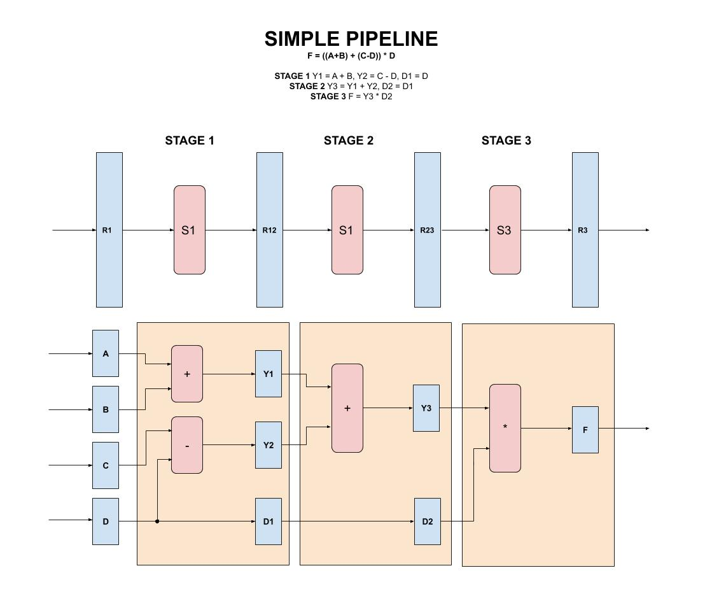

# simple-pipeline example

_A simple pipeline._

[GitHub Webpage](https://jeffdecola.github.io/my-systemverilog-examples/)

## SCHEMATIC

This may help,



## VERILOG CODE

The main part of the code is,

```verilog
    tbd
```

The entire code is
[simple-pipeline.v](simple-pipeline.v).

## RUN (SIMULATE)

I used my testbench
[simple-pipeline-tb.v](simple-pipeline-tb.v) with
[iverilog](https://github.com/JeffDeCola/my-cheat-sheets/tree/master/hardware/tools/simulation/iverilog-cheat-sheet)
to simulate and create a `.vcd` file.

```bash
sh run-test.sh
```

## CHECK WAVEFORM

Check you waveform using your `.vcd` file with a waveform viewer.

I used [GTKWave](https://github.com/JeffDeCola/my-cheat-sheets/tree/master/hardware/tools/simulation/gtkwave-cheat-sheet)
and launch it using
[launch-gtkwave.sh](launch-gtkwave.sh).


## TESTED IN HARDWARE - BURNED TO A FPGA

To test my design in real hardware, the above code was synthesized using the
[Xilinx Vivado](https://github.com/JeffDeCola/my-cheat-sheets/tree/master/hardware/tools/synthesis/xilinx-vivado-cheat-sheet)
IDE software suite and burned to a FPGA development board.
